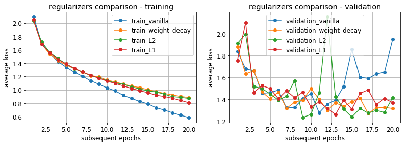
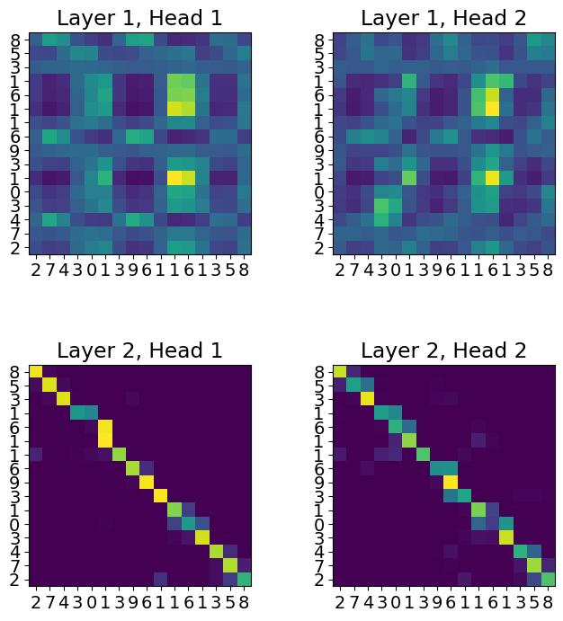

Machine Learning Applications course, spring 2024

[timeline and grading](rules.pdf)

## lecture notes:
- [machine learning fundamentals](https://drive.google.com/file/d/1S1kyjETWWD8Ajgc_X_f6nRGsYXWa7g8P/view?usp=sharing)
- [deep neural networks](https://drive.google.com/file/d/1cNBT1Np76QPU1lcnMNaWRd_prHCJ8Re6/view?usp=sharing)
- [decision trees and ensemble methods](https://drive.google.com/file/d/1yXvrphpWBYCJ07F0NDYfk-KBtUtF1Pji/view?usp=sharing)
- [convolutional neural networks](https://drive.google.com/file/d/1MMwRDtjgv43sQ2_v9wZ9EqPUbJfUIPKJ/view?usp=sharing)

<!--
- [computer vision: traditional methods](https://drive.google.com/file/d/1n2MOt2PkNl_4-wGW3q9o95zLqPaF3WYO/view?usp=sharing)
- [computer vision: deep-learning methods](https://drive.google.com/file/d/1wiWTQniLMvZVWVqxcSsoNdE57vneVf-2/view?usp=sharing)
- [recurrent neural networks](https://drive.google.com/file/d/1mBBBH6bfWt3gP_y3exfIHpnuVbi8x4QB/view?usp=sharing)
- [attention and transformers](https://drive.google.com/file/d/1PYARx84U70I_v-0UMalmJdrYfbtK9q6u/view?usp=sharing)
- [autoencoders and GANs](https://drive.google.com/file/d/1ub8-l1em4A22HCeephXdbNPEZCBJCw3Y/view?usp=sharing)
- [graph- and group-equivariant- neural networks](https://drive.google.com/file/d/1IAOaZSrGka6yIboazptO29aMYYnMy9Yw/view?usp=sharing)
- [self- and semi-supervised learning, synthetic data](https://drive.google.com/file/d/1e7cKVR90kfm1oT11cy9hlBknMmGt9XC4/view?usp=sharing)
-->

## laboratory classes:

1. Preliminary problems
- simple perceptron networks
- Universal Approximation Theorem
- [Colab notebook](https://colab.research.google.com/gist/jarek-pawlowski/18a24dcba8536ed4d1218c9a7bbd3eab/preliminary_problems.ipynb)
2. Handwritten digits classification using MNIST dataset with Pytorch
- models: perceptron, deep fully-connected network, generic CNN
- various activations
- overfitting
- regularization, early stopping
- [Colab notebook](https://colab.research.google.com/gist/jarek-pawlowski/a5177dbf879b7e1f6c0f1ec1f698a73e/mnist_in_3_flavours.ipynb)

3. ECG signal classification
- classifiers comparison: SVM, decision trees, random forests
- feature vectors
- scikit-learn library
- [Colab notebook](https://colab.research.google.com/gist/jarek-pawlowski/a504de96d401a02556f0cea58f8fd21a/ecg_classification.ipynb)

4. Deep CNNs
- VGG 
- degradation problem and ResNets
- model saving and visualization
- [Colab notebook](https://colab.research.google.com/gist/jarek-pawlowski/56f3f4c05d6bb54a2723edbf4109a678/advancedcnns.ipynb)

<!--
5. Regularization
- L2 and L1 regularization implemented by hand

[Colab notebook](regularization.ipynb)

6. Augmentation in image processing, two separated tasks:
- take MNIST or CIFAR dataset, apply some simple geometric transformations (see e.g. [lecture](CV2.pdf)), and check if such dataset extending improves accuracy (take some CNN model from previous labs):
    * use simple transformations (e.g. flip, rotate, translate, scale) using [scikit-image](https://scikit-image.org/docs/dev/api/skimage.transform.html), or [open-cv](https://docs.opencv.org/4.x/da/d6e/tutorial_py_geometric_transformations.html)
    * or use [albumentations](https://github.com/albumentations-team/albumentations) library, demo: https://demo.albumentations.ai/
    > * example of combining *albumentations* with pytorch *Dataset* is presented [here](pytorch_albumentations.ipynb)
    * in case of MNIST verify if applying flips or rotations > 45 deg improve accuracy or not, why?
- play with one-shot style transfer that might be also used for images augmentation (e.g. see [here](https://www.nature.com/articles/s41598-022-09264-z)), understand the idea, and run some exemplary code on your own images
> * papers:
>   * [Gatys original paper](https://www.cv-foundation.org/openaccess/content_cvpr_2016/papers/Gatys_Image_Style_Transfer_CVPR_2016_paper.pdf)
>   * https://arxiv.org/pdf/1904.11617v1.pdf 
> * code:
>   * https://github.com/limingcv/Photorealistic-Style-Transfer 
>   * https://github.com/KushajveerSingh/Photorealistic-Style-Transfer

7. Transformer network
- self-attention mechanism
- and Transformer encoder implemented from scratch

[Colab notebook](simple_Transformer.ipynb)

8. Convolutional GAN on MNIST
- generative adversarial network model: generator & discriminator 
- training GANs

[Colab notebook](GAN_on_MNIST.ipynb)

-->

## proposed seminars topics
- [list of proposed topics](seminar_topics.pdf)
